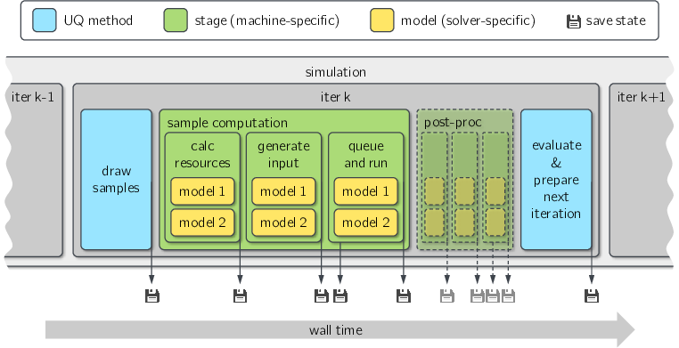

# Workflow

The simplified workflow of a PoUnce iteration is depicted in \autoref{fig:pounce_structure}. Colors indicate the responsible module. In each iteration, samples are drawn at first. Samples are then computed. This is done in a routine called a stage, which comprises several tasks: The required resources for each model (number of nodes and wall time) are calculated (\textit{calc resources}). Characteristics and restrictions of the cluster (such as cores per node and queue limits) are incorporated. Input is generated for the samples of each model via a solver-dependent application programming interface (API) (\textit{generate input}) and a job script is written. The job script is submitted to the job queue on the cluster, and its execution is monitored (\textit{queue and run}). At the end of this step, the correct finalization of the stage is verified and necessary output quantities are read, each with a solver-specific API. Several stages can be executed as part of a sample evaluation. For example, computational grids can be generated as a first stage (not shown in the figure), the main computation of the samples can be carried out as second, and the post-processing as a third. Each stage is assigned to a machine. Different stages can be run on different machines, for example if small pre-processing tasks require no large scale cluster. When the results are available, stochastic post-processing (such as variance estimation for each level or model) is carried out and the next iteration is prepared (e.g. by calculating the number of samples). Stochastic post-processing can be external (for computationally expensive QoIs such as random fields) or framework-internal. For checkpointing, the current state of the framework is saved after every step and additionally after submitting all jobs to the queue (indicated by the floppy disk items). Several QoIs of the same model can be evaluated simultaneously in PoUnce, which is not shown in the figure. Setup, archiving, and a final post-processing step are also omitted for brevity.
